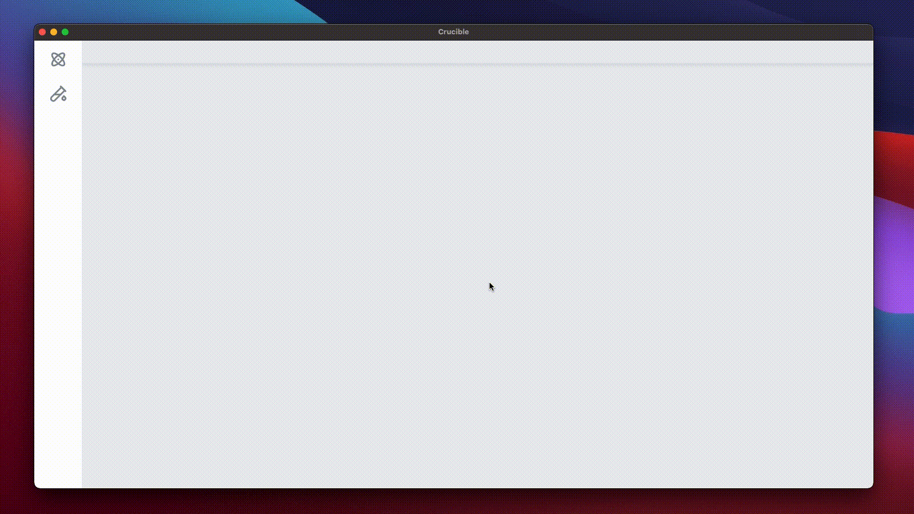

### A graphical testing suite for [AUnit](https://kaiyuanw.github.io/papers/paper5-icst18.pdf) and [Alloy](https://alloytools.org).

## What is Crucible?

Crucible is a no-code testing suite designed to streamline the production of AUnit test cases. Crucible is a cross-platform desktop application with support for Windows and MacOS.  Crucible comes bundled with V5 of the Alloy Analyzer, which it uses to evaluate tests and provide automated guidance during test creation.

## What is AUnit?

AUnit is a testing framework for Alloy. In lieu of ad-hoc validation practices, AUnit establishes
a formal specification for unit tests in Alloy.  [NEED MORE ON AUNIT HERE]

# Installation

## Requirements
Currently, distributions of Crucible are available for Windows and MacOS.  The installer for either platform can be downloaded at the releases page in this repository.

Because Crucible runs the AlloyAnalyzer, Java 18 is required and should be set in the home path of your environment.

Alternatively, you can clone this repository and run Crucible in development mode. For more on this see the Developing For Crucible section below.

# Getting Started

Getting started with Crucible is as simple as loading in your existing Alloy scripts.  For more information, see the walkthrough below:

### Create A Project

When you launch Crucible, you will be met with the Project Selection window.  To get started, select "New Project", and fill out the project creation form, being sure to point your new project to an existing Alloy file.

### Create A Test

Once you have created a new project, you will be met with the project window, where you will spend most of your time in Crucible.  To create your first test, open the test drawer by clicking the test tube icon on the left side of the window.  Select "New Test" to create your first test.

Now that we have a test, selecting it from the test drawer will open our canvas.  The canvas is the basis of a Crucible test.  To build our test, open the Atoms drawer on the left-hand side of the screen and drag some Atoms into the canvas.

Once we have a few Atoms, we will want to create connections between them.  Using the connection node on an atom, we can drag a connection to another atom.  

Valid connection targets will be highlighted green.  Multiplicity constraints are enforced and Crucible will notify you in the event you attempt to violate one.

### Running A Test

To run your test, click the green "Run" button in the upper left-hand corner of the canvas.  You will be notified if the test case passes or fails.  

[GIF OF RUNNING A TEST]

Additionally, you can modify your test by enabling predicates in the predicated window, which can be accessed via the purple "Predicates" button found adjacent to the "Run" button.  Predicates are disabled by default, but can be toggled to Valid or Invalid states at which point your test-case will be evaluated accordingly.

# Developing For Crucible

## The Technical Details

Crucible consists of two main components:  
- The frontend user interface, an Electron application with a React GUI

- The backend “server”, a Spring Boot API hooked up to the Alloy Analyzer JAR file, running on the localhost.

When you launch Crucible, both the GUI and the SpringBoot API are launched.  When you load an Alloy file into a new project, the file path is sent to the Alloy Analyzer via the API.  In Java world, the Alloy file is parsed and serialized into a JSON object before being sent back to the GUI where the JSON is processed further and saved into a local SQLite database.

When running a test, a command string is generated based on the graph and sent over to Alloy via the API. The command string is run, and the results are returned back to the GUI.

Project and test state are all maintained inside the SQLite database.

The SpringBoot API codebase can be found [here](https://github.com/AdamGEmerson/Crucible-API).

## Setting Up The Dev Environment

After cloning the repo, run `npm install`

Add a `.env` file in the project root with the following line:
    
> `DATABASE_URL="file:./dev.db"`

Then run the following command to initialize the SQLite database and prisma client.

> `npx prisma db push`

If you are working locally, `npm run start` will launch the Electron app and SpringBoot API in development mode. 

If you are ready to package the application, uncomment line 10 of `webpack.main.plugins.ts` or else you will end up with runtime errors.

